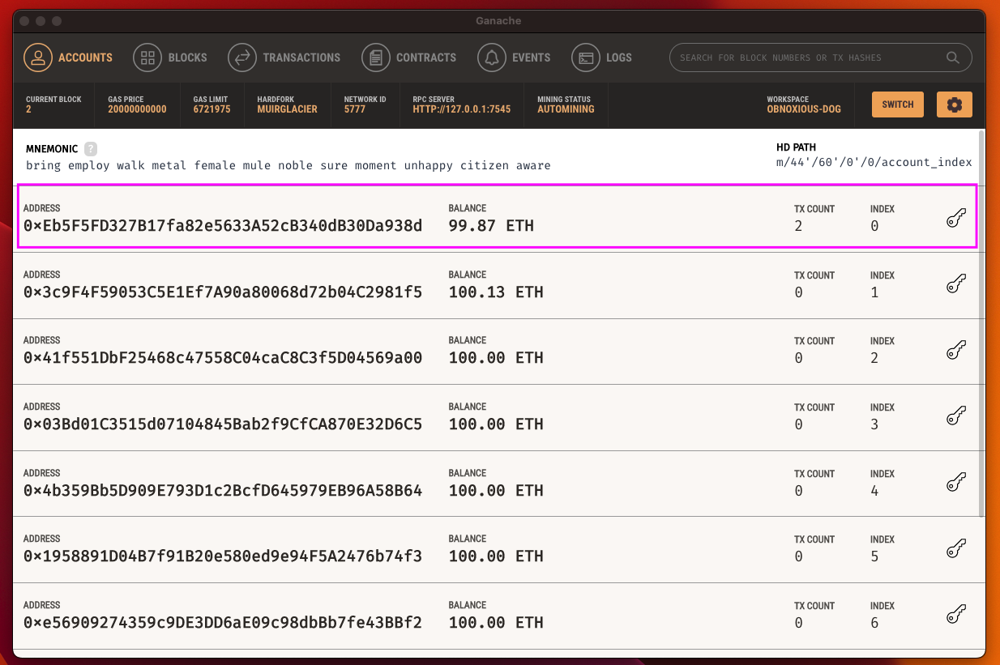
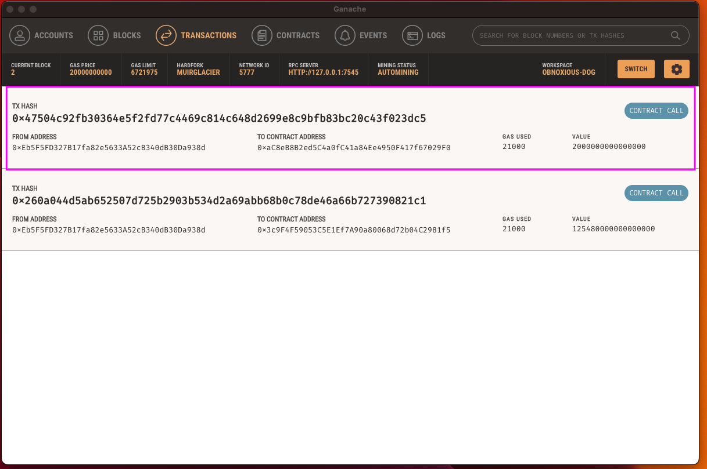

# Pychain

I work at a startup that is building a new and disruptive platform called Fintech Finder. Fintech Finder is an application that its customers can use to find fintech professionals from among a list of candidates, hire them, and pay them. As Fintech Finder’s lead developer, I have been tasked with integrating the Ethereum blockchain network into the application in order to enable  customers to instantly pay the fintech professionals whom they hire with cryptocurrency.


# Technology

This project uses Python 3.7 and the associated packages:

* [pandas](https://github.com/pandas-dev/pandas) - Flexible and powerful data analysis / manipulation library for Python, providing labeled data structures similar to R data.frame objects, statistical functions, and much more.

* [streamlit](https://streamlit.io/) - Streamlit turns data scripts into shareable web apps in minutes.
All in pure Python. No front‑end experience required.

* [web3](https://web3py.readthedocs.io/) - Web3.py is a Python library for interacting with Ethereum.

* [bip44](https://github.com/bitcoin/bips/blob/master/bip-0044.mediawiki) - Bitcoin Improvement Proposal (BIP) 44 defines the standard derivation path for wallets which generate Pay-to-Public-Key-Hash (P2PKH) addresses. BIP 44 also defines the prefixes to be used with associated extended keys.

# Installation Guide

Install the app's dependencies first.

```
  pip install pandas
  pip install streamlit
  pip install web3
  pip install bip44

```
---
# Usage

FullPage:


Account:



Transaction:




To review the codes, download and open fintech_finder.py

---

## Contributors
Kendren Cornish


---

## License

[MIT](https://choosealicense.com/licenses/mit/)